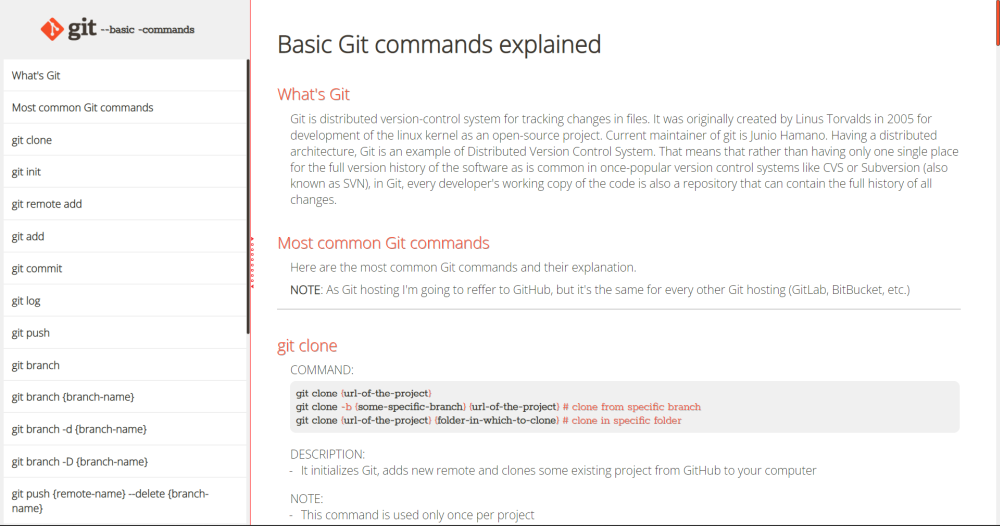

# freeCodeCamp Responsive Web Design certification

## Build a Technical Documentation Page project

Working example: https://raff1010x.github.io/05.Responsive-Web-Design-Projects--Build-a-Technical-Documentation-Page/

My git repo: https://github.com/Raff1010X/01.Roadmap

##

##

##

##

##

